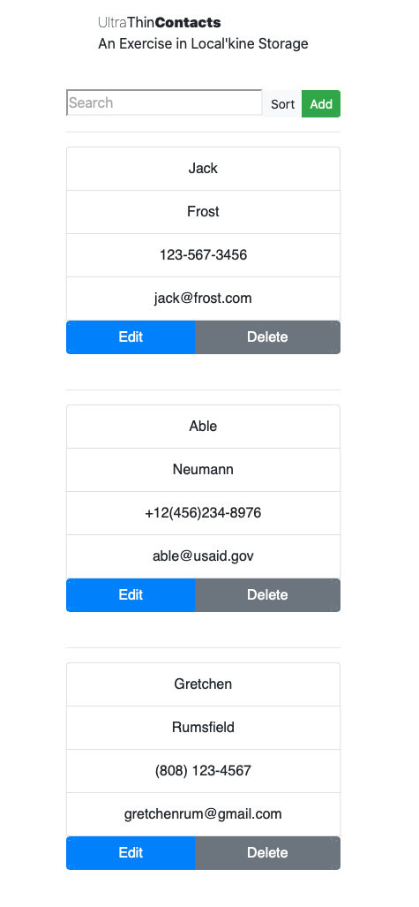

# Local'Kine Storage | Contact List

## Not the Best Practice

This was an exercise for a group hiring a bunch of remote React developer type. I'm a hacker, so, I repurposed some shiznits I found on the web so that I could apply for the spot.

Found a project on GitHub from a couple of years back called Phone-Book-React Master; it didn't answer the mail (no localstorage capabilities which was a "User Story" as part of this audition)
The React syntax was attrocious too; complete disregard for camelBack or SCREAMING_SNAKE. And of course, it was m,issing some other requirement mandated fields and functionality, like search that worked.
But it was a good start.
